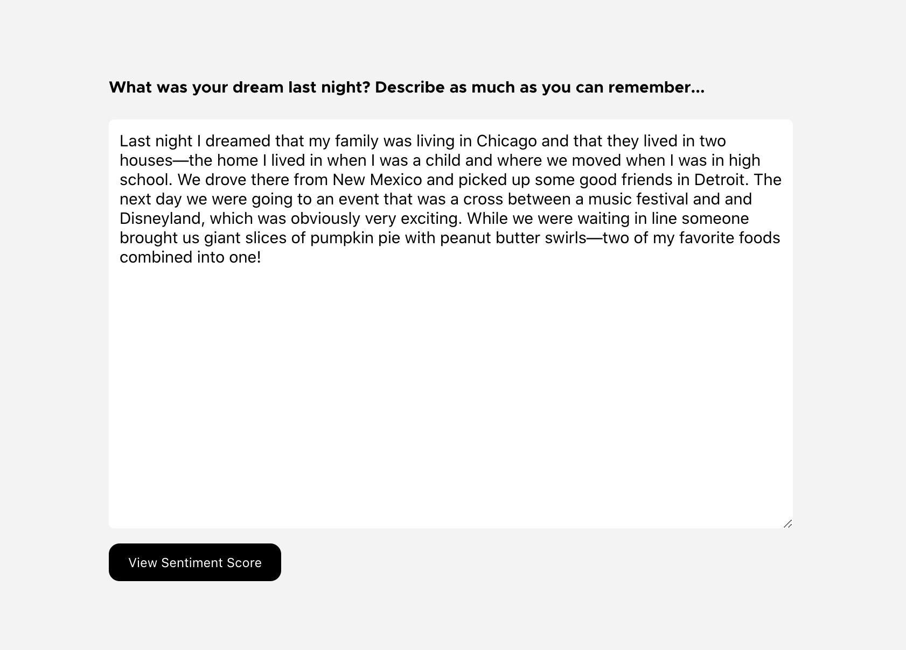
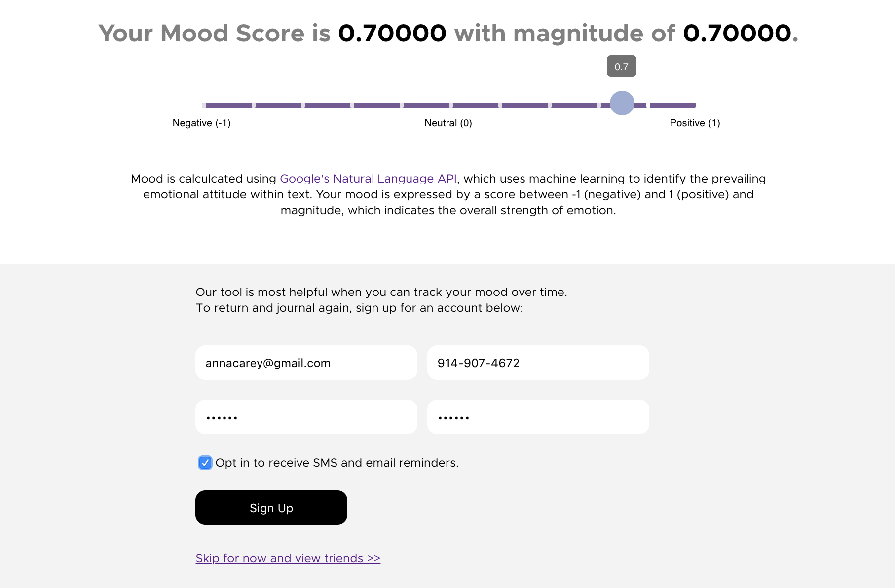

# DreamScore 

DreamScore is your personal dream journal that allows you to track your mood by recording your daily dreams. The application allows you to write down your dream each morning and then feeds the text into Google’s Natural Language API, which uses machine learning to determine the emotional attitude of a text. Your entry is given a score (-1 as negative and +1 as positive) which shows your mood. The technologies I used include: React, Ruby on Rails, Redux, ActiveRecord, Google's Natural Language API, Google's Geocoding API, Heroku, Twilio, Bcrypt, JWT, and Chron Jobs.

Backend repo: https://github.com/annacarey/mydreamscores-backend

You can find the application live at: http://www.mydreamscores.co/

## Background 

I started building this project in the very early days of the COVID-19 pandemic. While so many technologists, scientists, and economists were working on quantifying the physical and economic toll of COVID-19, I was interested in quantifying the emotional and psychological toll of the disease. Originally, I built a project that had a two-minute-timed daily journal entry around how people were feeling about COVID-19, but I became increasingly interested in dreams. Over the last few weeks, COVID dreams (and nightmares) have been a common topic of conversation as many people have started sharing their dreams on social media and in the press—and how dreaming has grown in frequency and vividness. 

Whether because of increased stress and anxiety, a response to a lack of stimuli during social isolation, or a just that people are sleeping more hours than normal, there is an undeniable connection between dreams and COVID-19. Beyond the pandemic, I am generally interested in how dreams reflect and predict our emotional and mental wellbeing, so I hope this project can help us track our mood both during and after the pandemic.

#### Resources about Dreams and COVID:
* [CNBC](https://www.cnbc.com/2020/04/03/why-youre-having-pandemic-related-nightmares-and-how-to-sleep-better.html)
* [Vox] (https://www.vox.com/the-goods/2020/4/9/21215312/quarantine-vivid-dreams-psychologist-q-and-a)
* [Smithsonian Magazine] (https://www.smithsonianmag.com/smart-news/insomnia-and-vivid-dreams-rise-pandemic-anxiety-180974726/)
* [Psychology Today](https://www.psychologytoday.com/us/blog/dreaming-in-the-digital-age/201705/keeping-dream-journal)

#### Resources about Dream Journaling:
* [Psychology Today] (https://www.psychologytoday.com/us/blog/dreaming-in-the-digital-age/201705/keeping-dream-journal)
* [Thrive Global] (https://thriveglobal.com/stories/5-reasons-why-you-should-keep-a-dream-journal/)
* [Masterclass](https://www.masterclass.com/articles/how-to-keep-a-dream-journal#how-to-keep-a-dream-journal)

## Reflections and Technologies

This application was built in React (frontend) and Ruby on Rails (backend) and uses Google's Natural Language Processing API and Geocoding API. The application also uses the Twilio API to send SMS reminders via chron jobs. 

Authenticating the APIs, restricting API keys to certain referrers, and safely securing the private information when deploying to Github and Heroku were some of the most challenging aspects of this project. For example, Google provides authentication secrets in a file and then requests that they be referenced in the application as a file path instead of individual environment variables. Heroku uses secrets in environment variables, so I had to find a workaround when deploying. Also, in order to stay within the free tiers of these APIs, I had to optimize my code to make as few API calls as few as possible. 

Another aspect of development that was challenging but fun was aggregating all of the data together in the global and regional averages on the dashboard.

## Video Demo

## Features

1. Sign up by entering your zipcode first or login. (Zipcode is fed into Google's geocoding API to get your region.)

2. Share the details of your dream in a digital journal.

 

3. When you press save, the text is fed into Google's Natural Language Processing API to get the "mood score." The signup page is found here (unless you are already logged in.)

4. Once you have signed up or logged in, you will see the dashboard with your most recent mood score, weekly and all-time averages as well as averages globally and by your region.

5. You can access your full history and see all past dream journal entries.

## Contributing
Pull requests are welcome. For major changes, please open an issue first to discuss what you would like to change.

## Contact
If you want to contact me, you can reach out at anna@annajcarey.com.

## License

Copyright (c) 2020 Anna Carey

Permission is hereby granted, free of charge, to any person obtaining a copy of this software and associated documentation files (the "Software"), to deal in the Software without restriction, including without limitation the rights to use, copy, modify, merge, publish, distribute, sublicense, and/or sell copies of the Software, and to permit persons to whom the Software is furnished to do so, subject to the following conditions:

The above copyright notice and this permission notice shall be included in all copies or substantial portions of the Software.

THE SOFTWARE IS PROVIDED "AS IS", WITHOUT WARRANTY OF ANY KIND, EXPRESS OR IMPLIED, INCLUDING BUT NOT LIMITED TO THE WARRANTIES OF MERCHANTABILITY, FITNESS FOR A PARTICULAR PURPOSE AND NONINFRINGEMENT. IN NO EVENT SHALL THE AUTHORS OR COPYRIGHT HOLDERS BE LIABLE FOR ANY CLAIM, DAMAGES OR OTHER LIABILITY, WHETHER IN AN ACTION OF CONTRACT, TORT OR OTHERWISE, ARISING FROM, OUT OF OR IN CONNECTION WITH THE SOFTWARE OR THE USE OR OTHER DEALINGS IN THE SOFTWARE.
